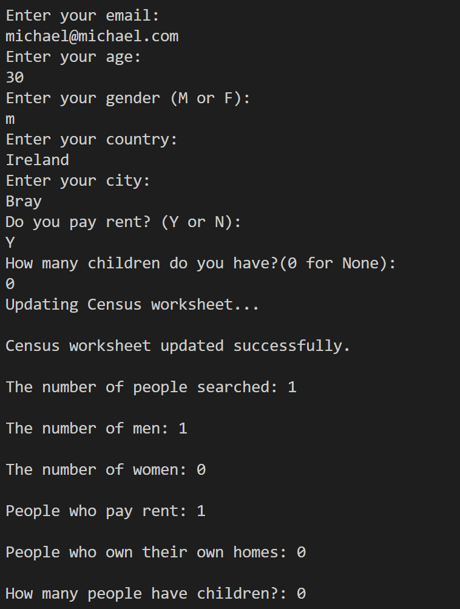
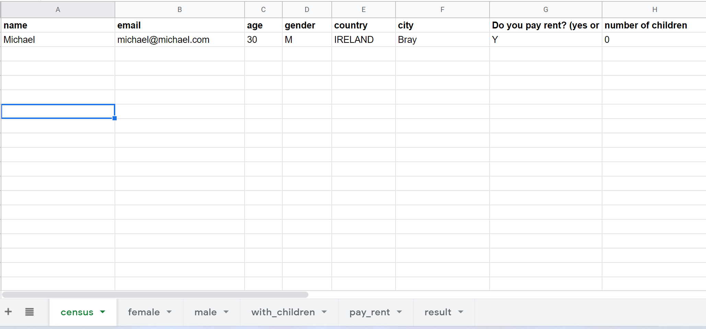
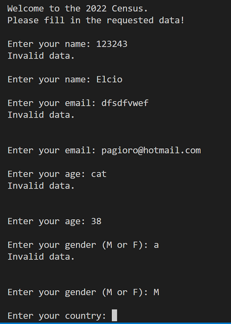

# Census Survey

Sensu survey is a tool for capturing data from a person, and the administrator will have a solid database for future analysis.

Here is the live version of my software!

# Features

### Existing Features

   - The program starts with the Census welcome message and the message to put data in the fields below.       
   - The person must fill in seven fields for data validation to be recorded.

   - The program is connected to google sheets.
   - They go to the main worksheet called Census as we enter the data.

   - When we enter the data, they are also separated into other tabs by gender, who pays the rent and if they have children.

   - In the program and the result tab, the total number of people is shown, how many are men or women if they have their own house, how many have children.

### Future Features

   - Will be added a graph in the results tab.
   - Will be added more input data.

# Testing

   - Passed the code through a PEP8 linter and confirmed there are no problems.
   - All data inputs have been tested and are working perfectly.
   - The validations in the fields were also tested and are correct. If the person types the email or in the name field with numbers, an error will appear and return to the same field.

    
   

# Unfixed Bugs    

   - No unfixed bugs.

# Fixed Bugs

   - Th  

## Validator Testing

   - No errors were returned from PEP8online.com

    

# Deployment

This project was deployed using Code Institute's mock terminal for Heroku.
   - Steps for deployment:
       - Fork or clone this repository
       - Create a new Heroku app
       - Link the Heroku app to this repository
       - Click on deploy

# Credits

   - Code institute for the deployment terminal
   - Love Sandwiches by the example given
   - Ultimate Battleships Sample README

